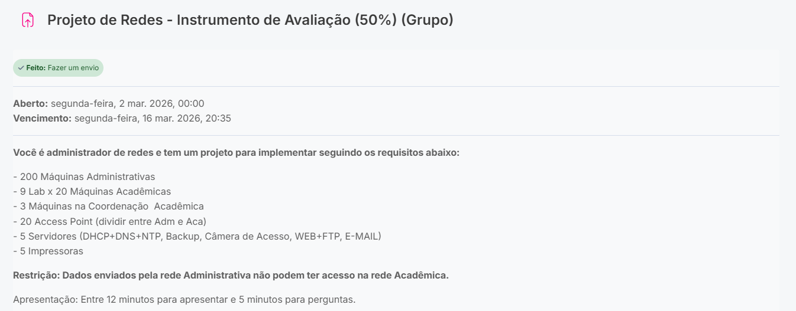
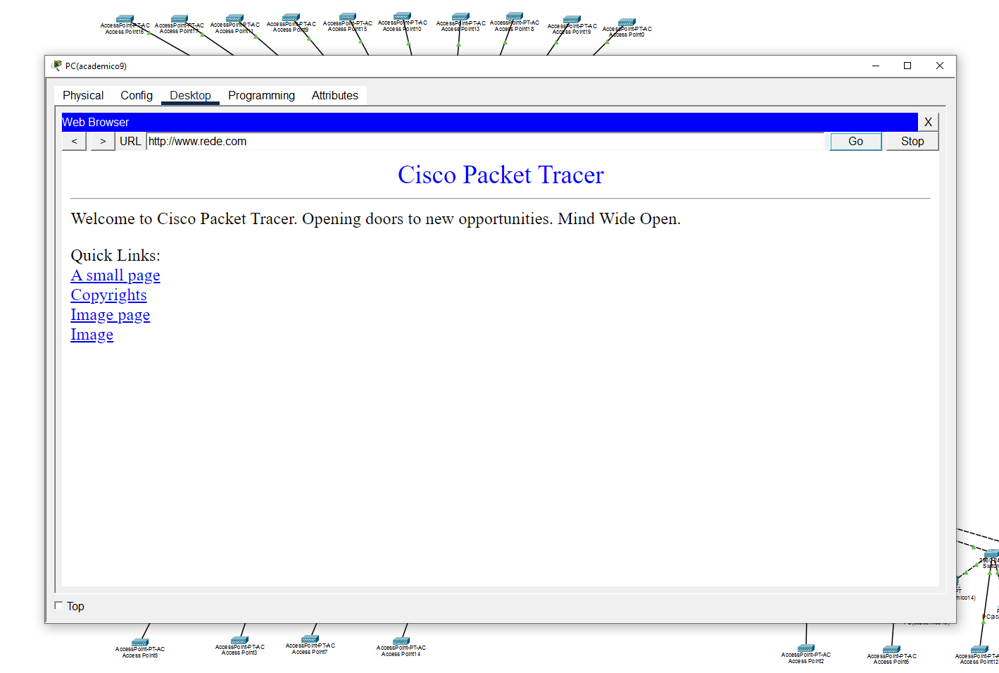

# Network-200-Machines
Segmented network infrastructure project for a university environment, focused on data security and traffic isolation (VLANs) for more than 400 hosts.

# 🌐 University Network Infrastructure Project (413 Hosts)

This project presents the implementation of a computer network for an academic and administrative environment, focusing on **traffic segmentation (VLANs)** and **data security**.

## 📋 Scenario and Requirements
The network was designed to support a robust infrastructure with the following assets:
* **Administrative Sector:** 200 Machines + 3 Coordination Machines.
* **Academic Sector:** 9 Laboratories (180 Machines in total).
* **Wi-Fi Infrastructure:** 20 Access Points distributed between Administrative and Academic areas.
* **Dedicated Servers:** DHCP, DNS, NTP, Backup, Cameras, Web, FTP, and Email.
* **Peripherals:** 5 Network Printers.
* 

  
<strong>👉 See Requirements 👈</strong>
 

   

  

    
  

## 🔒 Security Restriction
According to the project requirements, an isolation rule was implemented:
> **Rule:** The Administrative network is isolated from the Academic network. Traffic originating from the ADM network is not allowed to access hosts in the Academic network, ensuring the integrity of sensitive data.

## 🛠️ Technical Details
* **Segmentation:** Use of VLANs to separate broadcast domains.
* **Addressing:** Planning based on VLSM to optimize IP address space.
* **Security:** Implementation of ACLs (Access Control Lists) to block inter-VLAN traffic.

## 🧪 Testing and Demonstration Guide
To validate the implementation, follow the steps below in **Cisco Packet Tracer**:

### 1. Service Validation (Servers)
* **DHCP:** On any PC, go to *Desktop > IP Configuration* and select **DHCP**. The host should automatically receive an IP, Gateway, and DNS `[192.168.30.10]`.
* 

  
<strong>👉 See DHCP Test 👈</strong>

   

  

    <a href="https://youtu.be/YSQG_PBK8Nk">
      ▶️ Clique aqui para assistir o teste DHCP no YouTube
    </a>
  

* **Web (HTTP):** In the browser of any host, type `www.rede.com` (or your configured domain). The page should load successfully.
* 

  
<strong>👉 View HTTP Test 👈</strong>
 

   

  

    
  

* **E-mail:** Use the Mail Browser to send messages between users from different sectors.
* 

  
<strong>👉 View Gmail Test 👈</strong>

   

  

    <a href="https://youtu.be/FvvcAc9ALIA">
      ▶️ Clique aqui para assistir o teste GMAIL no YouTube
    </a>
  

* **FTP:** In the command prompt, use `ftp [192.168.30.10]` and log in to validate file access.
* 

  
<strong>👉 View FTP T 👈</strong>

   

  

    <a href="https://youtu.be/qavX0yRKnwk?si=LCtWKbSQlUwZ3PfX">
      ▶️ Clique aqui para assistir o teste FTP no YouTube
    </a>
  

### 2. Wi-Fi Infrastructure and Peripherals
* **Wi-Fi:** Connect a wireless device to the SSIDs of each sector. Verify that authentication and browsing are working properly.
* **Printing:** Perform a connectivity test (ping) between coordination machines and network printers `[192.168.20.205]` (for a printer in the academic network) `[192.168.10.201]` (for a printer in the administrative network).

### 3. Security Restriction Test (ACL)
This step validates the main isolation rule of the project:
1. Select a host in the **Administrative VLAN**.
2. Open **Desktop > Command Prompt**.
3. Attempt to `ping` an IP from the **Academic VLAN**.
4. **Expected result:** The ping should return **"Destination Host Unreachable"**, confirming that the ACL is blocking the traffic as required.
5. Try a `ping` to a host in the **same VLAN** or to the **Web Server**.
6. **Expected result:** Success (confirming that only restricted traffic is blocked).
7. 

    
<strong>👉 View ACL Security Test 👈</strong>
 

     

    

      
    

---
### 👤 Author
**Gabriel Canalli**  
*Systems Analysis and Development Student (3rd Semester)*
